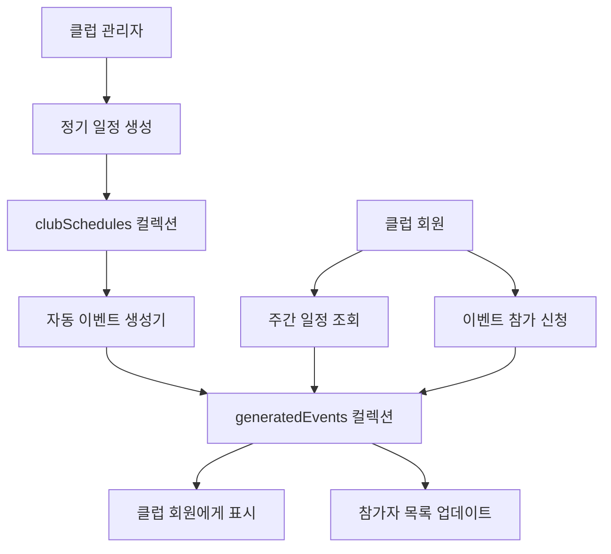

# 📅 Lightning Pickleball 클럽 정기 모임 일정 시스템 설계

## 🎯 개요

Lightning Pickleball의 **클럽 정기 모임 일정(Club Schedules)** 시스템은 피클볼 클럽들이 매주 반복되는 정기 모임, 연습, 리그 경기 등을 효율적으로 관리할 수 있도록 설계되었습니다. 이 시스템을 통해 클럽 회원들은 정기적인 피클볼 활동을 쉽게 확인하고 참여할 수 있습니다.

## 🏗️ 시스템 아키텍처

### 핵심 구성 요소

1. **`clubSchedules` Firestore 컬렉션** - 정기 일정 템플릿 저장
2. **`generatedEvents` Firestore 컬렉션** - 실제 생성된 이벤트 인스턴스
3. **ClubScheduleService** - 일정 관리 비즈니스 로직
4. **TypeScript 타입 시스템** - 완전한 타입 안전성
5. **자동 이벤트 생성 시스템** - 정기 일정에서 실제 이벤트 자동 생성

### 데이터 플로우



## 📊 Firestore 데이터베이스 구조

### `clubSchedules` 컬렉션 (정기 일정 템플릿)

```typescript
// Document ID: auto-generated
{
  clubId: string,              // 클럽 ID

  // 일정 정보
  title: string,               // "Wednesday Evening Practice"
  description: string,         // 상세 설명
  scheduleType: string,        // 'practice' | 'social' | 'league_match' 등

  // 시간 정보
  dayOfWeek: number,          // 0-6 (일요일-토요일)
  time: string,               // "19:00" (24시간 형식)
  duration: number,           // 120 (분 단위)
  timezone: string,           // "America/New_York"

  // 장소 정보
  location: {
    name: string,             // "Central Park Pickleball Courts"
    address: string,          // 전체 주소
    courtIds: [string],       // 특정 코트 ID들
    coordinates: {            // GPS 좌표
      latitude: number,
      longitude: number
    },
    instructions: string,     // 찾아오는 방법
    indoorOutdoor: string     // 'indoor' | 'outdoor' | 'both'
  },

  // 참가 정보
  participationInfo: {
    minParticipants: number,  // 최소 참가자
    maxParticipants: number,  // 최대 참가자
    skillLevelRequired: string, // "3.5+"
    skillLevelRange: {
      min: string,
      max: string
    },
    registrationRequired: boolean,
    registrationDeadline: number, // 이벤트 N시간 전
    memberOnly: boolean,      // 클럽 회원만
    guestAllowed: boolean,    // 게스트 허용
    maxGuestsPerMember: number,
    fee: {
      amount: number,
      currency: string,       // "USD" | "KRW"
      type: string,          // 'per_session' | 'monthly' | 'included'
      description: string,
      paymentMethods: [string]
    }
  },

  // 반복 규칙
  recurrence: {
    frequency: string,        // 'weekly' | 'biweekly' | 'monthly'
    interval: number,         // 매 N주/월
    startDate: Timestamp,     // 시작일
    endDate: Timestamp,       // 종료일 (선택)
    count: number,           // 총 횟수 (선택)
    weekOfMonth: string,     // 'first' | 'second' | 'third' | 'fourth' | 'last'
    monthlyType: string,     // 'dayOfMonth' | 'dayOfWeek'
    excludeDates: [Timestamp], // 제외할 날짜들
    includeDates: [Timestamp]  // 추가할 날짜들
  },

  // 상태 및 메타데이터
  isActive: boolean,
  createdBy: string,         // 생성자 ID
  createdAt: Timestamp,
  updatedAt: Timestamp,

  // 추가 기능
  reminders: {
    enabled: boolean,
    reminderTimes: [{
      amount: number,
      unit: string,          // 'minutes' | 'hours' | 'days'
      beforeEvent: boolean
    }],
    reminderMethods: [string] // 'push' | 'email' | 'sms'
  },

  exceptions: [{             // 예외 사항들
    date: Timestamp,
    reason: string,
    type: string,            // 'cancelled' | 'rescheduled' | 'location_change'
    alternativeDetails: {
      time: string,
      location: {...},
      notes: string
    },
    notificationSent: boolean
  }],

  specialInstructions: string // 특별 안내사항
}
```

### `generatedEvents` 컬렉션 (실제 이벤트 인스턴스)

```typescript
// Document ID: auto-generated
{
  scheduleId: string,         // 부모 schedule ID
  clubId: string,
  eventDate: Timestamp,       // 실제 이벤트 날짜/시간
  status: string,            // 'scheduled' | 'in_progress' | 'completed' | 'cancelled'

  // 일정에서 상속받은 정보 (수정 가능)
  title: string,
  location: {...},
  time: string,
  duration: number,

  // 인스턴스별 데이터
  registeredParticipants: [userId1, userId2, ...],
  waitlist: [userId3, userId4, ...],
  attendance: [{
    userId: string,
    status: string,          // 'present' | 'absent' | 'late' | 'excused'
    checkInTime: Timestamp,
    notes: string
  }],
  notes: string,             // 이번 모임 특별 사항

  // 수정 정보
  isModified: boolean,       // 원본 일정과 다른지
  modifications: {
    modifiedFields: [string],
    modifiedBy: string,
    modifiedAt: Timestamp,
    reason: string,
    originalValues: {...}
  }
}
```

## 🎨 일정 유형 (Schedule Types)

### 1. 정기 연습 (Practice Session)

```typescript
{
  scheduleType: 'practice',
  title: '수요일 저녁 연습',
  dayOfWeek: 3, // Wednesday
  time: '19:00',
  duration: 120,
  participationInfo: {
    minParticipants: 4,
    maxParticipants: 12,
    skillLevelRequired: '3.0+',
    memberOnly: true
  }
}
```

### 2. 친목 피클볼 (Social Pickleball)

```typescript
{
  scheduleType: 'social',
  title: '토요일 아침 친목 피클볼',
  dayOfWeek: 6, // Saturday
  time: '09:00',
  duration: 180,
  participationInfo: {
    memberOnly: false,
    guestAllowed: true,
    maxGuestsPerMember: 2
  }
}
```

### 3. 리그 경기 (League Match)

```typescript
{
  scheduleType: 'league_match',
  title: '클럽 리그 경기일',
  dayOfWeek: 0, // Sunday
  time: '14:00',
  duration: 240,
  participationInfo: {
    registrationRequired: true,
    registrationDeadline: 48, // 48시간 전
    skillLevelRange: {
      min: '3.5',
      max: '4.5'
    }
  }
}
```

## 🔧 주요 서비스 메서드

### ClubScheduleService 클래스

#### 일정 관리

```typescript
// 정기 일정 생성
createSchedule(schedule: Omit<ClubSchedule, 'id'>): Promise<string>

// 클럽 일정 조회
getClubSchedules(clubId: string, activeOnly?: boolean): Promise<ClubSchedule[]>

// 일정 업데이트
updateSchedule(scheduleId: string, updates: Partial<ClubSchedule>): Promise<void>

// 일정 비활성화 (소프트 삭제)
deactivateSchedule(scheduleId: string): Promise<void>
```

#### 이벤트 생성 및 관리

```typescript
// 일정에서 이벤트 자동 생성 (N주 앞서)
generateEventsForSchedule(scheduleId: string, weeksAhead?: number): Promise<string[]>

// 특정 날짜의 이벤트 조회
getGeneratedEventForDate(scheduleId: string, date: Date): Promise<GeneratedEvent | null>

// 미래 이벤트 재생성 (일정 수정 시)
regenerateFutureEvents(scheduleId: string): Promise<void>

// 미래 이벤트 취소
cancelFutureEvents(scheduleId: string): Promise<void>
```

#### 참가 관리

```typescript
// 이벤트 참가 신청
registerForEvent(eventId: string, userId: string): Promise<'registered' | 'waitlisted'>

// 참가 취소
cancelEventRegistration(eventId: string, userId: string): Promise<void>

// 출석 체크
markAttendance(eventId: string, userId: string, status: string): Promise<void>
```

#### 조회 및 표시

```typescript
// 주간 일정 뷰 조회
getWeeklyScheduleView(
  clubId: string,
  weekStartDate: Date,
  userId?: string
): Promise<WeeklyScheduleView>

// 일정 충돌 확인
checkScheduleConflict(conflictCheck: ScheduleConflictCheck): Promise<boolean>

// 실시간 구독
subscribeToClubSchedules(clubId: string, callback: Function): Unsubscribe
subscribeToUpcomingEvents(clubId: string, callback: Function): Unsubscribe
```

## 🎯 자동 이벤트 생성 로직

### 이벤트 생성 프로세스

1. **정기 일정 생성 시**
   - 자동으로 향후 4주간의 이벤트 생성
   - 각 이벤트는 독립적인 문서로 저장

2. **주기적 업데이트**
   - 매주 새로운 이벤트 자동 생성
   - 항상 4주 앞까지의 이벤트 유지

3. **일정 수정 시**
   - 미래 이벤트 자동 재생성
   - 이미 참가자가 있는 이벤트는 별도 처리

### 예외 처리

```typescript
// 특정 날짜 제외
exceptions: [
  {
    date: Timestamp.fromDate(new Date('2025-12-25')),
    reason: 'Christmas Holiday',
    type: 'cancelled',
    notificationSent: true,
  },
];

// 일시적 변경
exceptions: [
  {
    date: Timestamp.fromDate(new Date('2025-08-15')),
    reason: 'Court maintenance',
    type: 'location_change',
    alternativeDetails: {
      location: {
        name: 'Brooklyn Pickleball Center',
        address: '123 Brooklyn St',
      },
    },
  },
];
```

## 📱 UI/UX 디자인 가이드라인

### 주간 일정 표시

```typescript
interface WeeklyScheduleView {
  clubId: string;
  weekStartDate: Date;
  schedules: DailySchedule[];
  totalEvents: number;
  userRegisteredCount: number;
}

// 일별 일정
interface DailySchedule {
  date: Date;
  dayOfWeek: DayOfWeek;
  events: ScheduleDisplayData[];
  isToday: boolean;
  hasConflicts: boolean;
}
```

### 일정 카드 표시

```typescript
// 일정 표시 데이터
interface ScheduleDisplayData {
  schedule: ClubSchedule;
  nextOccurrence: Date;
  isToday: boolean;
  isThisWeek: boolean;
  spotsAvailable?: number;
  userRegistrationStatus?: 'registered' | 'waitlisted' | 'not_registered';
  canRegister: boolean;
  conflictsWith?: string[];
}
```

## 🌐 다국어 지원

### 요일 표시

```typescript
const DAY_OF_WEEK_LABELS = {
  en: {
    0: 'Sunday',
    1: 'Monday',
    2: 'Tuesday',
    3: 'Wednesday',
    4: 'Thursday',
    5: 'Friday',
    6: 'Saturday',
  },
  ko: {
    0: '일요일',
    1: '월요일',
    2: '화요일',
    3: '수요일',
    4: '목요일',
    5: '금요일',
    6: '토요일',
  },
};
```

### 일정 유형 표시

```typescript
const SCHEDULE_TYPE_LABELS = {
  en: {
    practice: 'Practice Session',
    social: 'Social Pickleball',
    league_match: 'League Match',
    clinic: 'Training Clinic',
  },
  ko: {
    practice: '연습 세션',
    social: '친목 피클볼',
    league_match: '리그 경기',
    clinic: '트레이닝 클리닉',
  },
};
```

## 🔔 알림 시스템

### 자동 알림 시점

1. **이벤트 생성 시** - 새로운 정기 모임 알림
2. **참가 신청 마감 임박** - N시간 전 알림
3. **이벤트 당일** - 리마인더 알림
4. **일정 변경 시** - 참가자에게 변경 알림
5. **대기자 승급** - 자리가 났을 때 알림

### 알림 설정

```typescript
reminders: {
  enabled: true,
  reminderTimes: [
    { amount: 24, unit: 'hours', beforeEvent: true },  // 하루 전
    { amount: 2, unit: 'hours', beforeEvent: true }    // 2시간 전
  ],
  reminderMethods: ['push', 'email']
}
```

## 🔐 보안 및 권한

### 권한 체계

1. **클럽 관리자** - 일정 생성/수정/삭제 권한
2. **클럽 매니저** - 일정 수정, 참가자 관리 권한
3. **클럽 회원** - 참가 신청/취소 권한
4. **일반 사용자** - 공개 일정 조회만 가능

### 데이터 검증

- 시간 형식 검증 (24시간 형식)
- 일정 충돌 자동 감지
- 참가자 수 제한 확인
- 스킬 레벨 요구사항 확인

## 📈 성능 최적화

### 쿼리 최적화

- 인덱스: `clubId + dayOfWeek + time`
- 인덱스: `clubId + isActive + dayOfWeek`
- 인덱스: `eventDate + status`

### 캐싱 전략

- 주간 일정 로컬 캐싱
- 자주 변경되지 않는 일정 정보 캐싱
- 실시간 업데이트는 참가자 정보만

## 🚀 향후 확장 계획

### Phase 1 - 기본 기능 (현재)

- [x] 일정 CRUD 작업
- [x] 자동 이벤트 생성
- [x] 참가 신청/취소
- [x] 주간 일정 뷰

### Phase 2 - 고급 기능

- [ ] 반복 패턴 고도화 (격주, 월간)
- [ ] 캘린더 앱 연동 (Google, Apple)
- [ ] 대기자 자동 승급 시스템
- [ ] 참가 통계 및 분석

### Phase 3 - 통합 기능

- [ ] 리그/토너먼트와 연동
- [ ] 코치 레슨 일정 통합
- [ ] 결제 시스템 연동
- [ ] QR 코드 체크인

## 📋 구현 체크리스트

### 백엔드 (Firestore & Services)

- [x] `clubSchedules` 컬렉션 구조 설계
- [x] `generatedEvents` 컬렉션 구조 설계
- [x] TypeScript 타입 정의 완료
- [x] ClubScheduleService 구현
- [x] 자동 이벤트 생성 로직
- [x] 참가 신청/취소 로직
- [ ] 보안 규칙 설정
- [ ] 인덱스 최적화

### 프론트엔드 (React Native)

- [ ] 일정 생성 UI
- [ ] 주간 일정 캘린더 뷰
- [ ] 일정 상세 화면
- [ ] 참가 신청 UI
- [ ] 참가자 목록 표시
- [ ] 일정 수정/삭제 UI
- [ ] 알림 설정 UI

### 통합 및 테스트

- [ ] 클럽 관리 시스템과 연동
- [ ] 알림 시스템 연동
- [ ] 성능 테스트
- [ ] 사용자 테스트

---

Lightning Pickleball의 클럽 정기 모임 일정 시스템은 피클볼 클럽들이 체계적으로 운영될 수 있도록 돕는 핵심 기능입니다. 자동화된 이벤트 생성과 유연한 반복 규칙을 통해 클럽 관리자의 부담을 줄이고, 회원들에게는 예측 가능한 피클볼 활동을 제공합니다.
