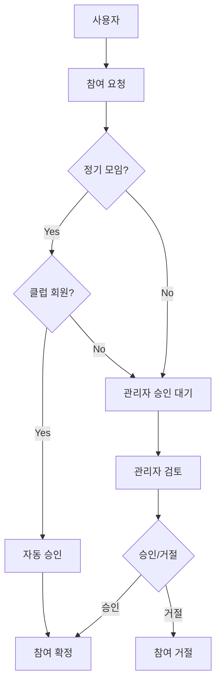

# 🎾 Lightning Pickleball 이벤트 참여 시스템 설계

## 🎯 개요

Lightning Pickleball의 **이벤트 참여 시스템**은 사용자가 Lightning 이벤트(매치, 모임)에 참여할 수 있도록 하는 핵심 기능입니다. 특히 **정기 모임**에 대해서는 **클럽 회원 자동 승인** 기능을 제공하여 편의성을 높입니다.

## 🌟 핵심 기능

### 1. **스마트 자동 승인 시스템** ✨

- **정기 모임** + **클럽 회원** = **즉시 자동 승인**
- **일반 이벤트** = **관리자 승인 필요**
- **정기 모임** + **비회원** = **관리자 승인 필요**

### 2. **유연한 참여 유형**

- **Participant (참가자)**: 실제 경기/모임 참여
- **Spectator (관람자)**: 경기 관람
- **Helper (도우미)**: 이벤트 운영 지원

### 3. **대기자 관리**

- 정원 초과시 자동 대기자 명단 등록
- 취소 발생시 자동 승급
- 우선순위 기반 대기 순서

### 4. **실시간 알림**

- 참여 상태 변경 알림
- 자동 승인 알림
- 관리자 승인 요청 알림

## 🏗️ 시스템 아키텍처

### 핵심 구성 요소

1. **Cloud Functions**
   - `requestEventParticipation` - 참여 요청 처리
   - `updateParticipationStatus` - 승인/거절 처리

2. **Firestore Collections**
   - `eventParticipations` - 참여 요청 데이터
   - `events` - 이벤트 정보
   - `clubMembers` - 클럽 회원 정보

3. **Client Service**
   - `EventParticipationService` - 클라이언트 API

4. **TypeScript Types**
   - 완전한 타입 안전성
   - 다국어 지원

### 데이터 플로우



## 📊 Firestore 데이터 구조

### `eventParticipations` 컬렉션

```typescript
{
  id: string,                    // 자동 생성 ID
  eventId: string,               // 이벤트 ID
  userId: string,                // 참여 요청 사용자 ID
  participationType: string,     // 'participant' | 'spectator' | 'helper'
  status: string,                // 'pending' | 'approved' | 'rejected' | 'waitlisted'
  approvalReason: string,        // 승인 사유

  // 시간 정보
  requestedAt: Timestamp,        // 요청 시간
  approvedAt: Timestamp,         // 승인 시간
  rejectedAt: Timestamp,         // 거절 시간
  waitlistedAt: Timestamp,       // 대기자 등록 시간

  // 승인/거절 정보
  approvedBy: string,            // 승인자 ID
  rejectedBy: string,            // 거절자 ID
  rejectionReason: string,       // 거절 사유

  // 대기자 관련
  waitlistPosition: number,      // 대기 순서
  waitlistPriority: number,      // 우선순위 점수

  // 이벤트 스냅샷
  eventSnapshot: {
    title: string,
    dateTime: Timestamp,
    location: {
      name: string,
      address: string
    },
    clubId: string,
    type: string,
    isRegularMeeting: boolean
  },

  // 메타데이터
  notes: string,                 // 참여자 메모
  adminNotes: string,           // 관리자 메모
  createdAt: Timestamp,
  updatedAt: Timestamp
}
```

## 🤖 Cloud Function 상세 설계

### 1. `requestEventParticipation`

```javascript
/**
 * 이벤트 참여 요청 처리
 * @param {Object} data - { eventId, participationType }
 * @returns {Object} - 참여 요청 결과
 */
```

**처리 로직:**

1. 사용자 인증 확인
2. 이벤트 존재 및 상태 확인
3. 중복 참여 확인
4. 참가자 수 제한 확인
5. **자동 승인 대상 확인**
6. 참여 요청 생성
7. 알림 발송

**자동 승인 조건:**

```javascript
// 1. 정기 모임 이벤트인지 확인
const isRegularMeeting =
  eventData.tags &&
  (eventData.tags.includes('정기모임') || eventData.tags.includes('regular_meeting'));

// 2. 클럽 회원인지 확인
const membershipQuery = await db
  .collection('clubMembers')
  .where('clubId', '==', clubId)
  .where('userId', '==', userId)
  .where('status', '==', 'active')
  .get();

// 3. 자동 승인 결정
if (isRegularMeeting && !membershipQuery.empty) {
  return { eligible: true, reason: 'club_member_regular_meeting' };
}
```

### 2. `updateParticipationStatus`

```javascript
/**
 * 참여 상태 업데이트 (관리자용)
 * @param {Object} data - { participationId, status, reason }
 * @returns {Object} - 업데이트 결과
 */
```

**처리 로직:**

1. 관리자 권한 확인
2. 참여 요청 상태 업데이트
3. 승인시 참가자 수 증가
4. 알림 발송

## 📱 클라이언트 서비스 API

### EventParticipationService 메서드

```typescript
// 참여 요청
async requestParticipation(eventId: string, type: ParticipationType): Promise<ParticipationRequestResponse>

// 참여 상태 업데이트 (관리자용)
async updateParticipationStatus(participationId: string, status: 'approved' | 'rejected', reason?: string): Promise<UpdateResult>

// 사용자 참여 목록 조회
async getUserParticipations(userId: string): Promise<EventParticipationRequest[]>

// 이벤트 참여자 목록 조회
async getEventParticipations(eventId: string): Promise<EventParticipationRequest[]>

// 승인된 참가자 조회
async getApprovedParticipants(eventId: string): Promise<EventParticipationRequest[]>

// 대기자 목록 조회
async getWaitlistedParticipants(eventId: string): Promise<EventParticipationRequest[]>

// 실시간 구독
subscribeToEventParticipations(eventId: string, callback: Function): Unsubscribe
```

## 🔔 알림 시스템

### 알림 유형

1. **참여자 알림**
   - 자동 승인: "정기 모임 참여 확정!"
   - 요청 전송: "이벤트 참여 요청 완료"
   - 승인: "이벤트 참여 승인!"
   - 거절: "이벤트 참여 거절"

2. **관리자 알림**
   - 새 요청: "새로운 참여 요청"
   - 자동 승인: "회원 자동 참여"

3. **클럽 관리자 알림**
   - 클럽 이벤트 참여 현황

### 다국어 지원

```typescript
const PARTICIPATION_MESSAGES = {
  ko: {
    autoApprovalTitle: '정기 모임 참여 확정!',
    autoApprovalBody: '{eventTitle} 모임 참여가 자동으로 승인되었습니다.',
  },
  en: {
    autoApprovalTitle: 'Regular Meeting Participation Confirmed!',
    autoApprovalBody: 'Your participation in {eventTitle} has been automatically approved.',
  },
};
```

## 🎯 핵심 비즈니스 로직

### 자동 승인 조건

```typescript
interface AutoApprovalConditions {
  isRegularMeeting: boolean; // 정기 모임 여부
  isClubMember: boolean; // 클럽 회원 여부
  membershipActive: boolean; // 활성 회원 여부
  clubId: string; // 클럽 ID 존재
}

// 자동 승인 = 정기 모임 && 활성 클럽 회원
const autoApprove =
  conditions.isRegularMeeting &&
  conditions.isClubMember &&
  conditions.membershipActive &&
  conditions.clubId;
```

### 대기자 우선순위 계산

```typescript
function calculateWaitlistPriority(userId: string, eventData: EventData): number {
  let priority = 50; // 기본 점수

  // 클럽 회원 +30점
  if (isClubMember(userId, eventData.clubId)) {
    priority += 30;
  }

  // 정기 참석자 +20점
  if (isRegularParticipant(userId, eventData)) {
    priority += 20;
  }

  // VIP 회원 +10점
  if (isVipMember(userId)) {
    priority += 10;
  }

  return priority;
}
```

## 📊 통계 및 분석

### 참여 통계

```typescript
interface ParticipationStats {
  totalRequests: number; // 총 요청 수
  approved: number; // 승인된 요청
  rejected: number; // 거절된 요청
  waitlisted: number; // 대기 중 요청
  autoApproved: number; // 자동 승인
  manualApproved: number; // 수동 승인

  // 비율
  autoApprovalRate: number; // 자동 승인율
  approvalRate: number; // 전체 승인율
  showUpRate: number; // 실제 참석률
}
```

### 이벤트별 참여 요약

```typescript
interface EventParticipationSummary {
  eventId: string;
  totalParticipants: number;
  confirmedParticipants: number;
  waitlistedParticipants: number;
  maxParticipants?: number;

  participantsByType: {
    participants: number;
    spectators: number;
    helpers: number;
  };
}
```

## 🔐 보안 및 권한

### 권한 계층

1. **참여자 권한**
   - 자신의 참여 요청/취소
   - 참여 상태 조회

2. **이벤트 호스트 권한**
   - 이벤트 참여 요청 승인/거절
   - 참가자 목록 관리

3. **클럽 관리자 권한**
   - 클럽 이벤트 참여 요청 승인/거절
   - 클럽 이벤트 참여 통계 조회

4. **시스템 관리자 권한**
   - 모든 이벤트 참여 관리
   - 전체 통계 조회

### 데이터 검증

```javascript
// 입력 데이터 검증
function validateParticipationRequest(data) {
  if (!data.eventId) throw new Error('Event ID required');
  if (!['participant', 'spectator', 'helper'].includes(data.participationType)) {
    throw new Error('Invalid participation type');
  }
  // ... 추가 검증
}

// 권한 검증
async function checkApprovalPermission(userId, eventData) {
  // 이벤트 호스트 확인
  if (eventData.hostId === userId) return true;

  // 클럽 관리자 확인
  if (eventData.clubId) {
    const isClubAdmin = await isUserClubAdmin(userId, eventData.clubId);
    return isClubAdmin;
  }

  return false;
}
```

## 🚀 성능 최적화

### 쿼리 최적화

```javascript
// 필요한 인덱스
// eventParticipations: eventId + status + requestedAt
// eventParticipations: userId + requestedAt
// eventParticipations: eventSnapshot.clubId + status + requestedAt
// clubMembers: clubId + userId + status
```

### 캐싱 전략

```javascript
// 자주 조회되는 데이터 캐싱
const participationCache = new Map();

async function getCachedParticipations(eventId) {
  const cacheKey = `event_participations_${eventId}`;

  if (participationCache.has(cacheKey)) {
    const cached = participationCache.get(cacheKey);
    if (Date.now() - cached.timestamp < 60000) {
      // 1분 캐시
      return cached.data;
    }
  }

  const data = await getEventParticipations(eventId);
  participationCache.set(cacheKey, {
    data,
    timestamp: Date.now(),
  });

  return data;
}
```

## 🧪 테스트 시나리오

### 자동 승인 테스트

```javascript
describe('Auto Approval Logic', () => {
  test('클럽 회원 + 정기 모임 = 자동 승인', async () => {
    // Given
    const eventData = {
      tags: ['정기모임'],
      clubId: 'test-club-1',
    };
    const userId = 'club-member-1';

    // When
    const result = await checkAutoApprovalEligibility(eventData, userId);

    // Then
    expect(result.eligible).toBe(true);
    expect(result.reason).toBe('club_member_regular_meeting');
  });

  test('비회원 + 정기 모임 = 수동 승인', async () => {
    // Given
    const eventData = {
      tags: ['정기모임'],
      clubId: 'test-club-1',
    };
    const userId = 'non-member-1';

    // When
    const result = await checkAutoApprovalEligibility(eventData, userId);

    // Then
    expect(result.eligible).toBe(false);
    expect(result.reason).toBe('not_club_member');
  });
});
```

### 대기자 승급 테스트

```javascript
describe('Waitlist Promotion', () => {
  test('참여 취소시 대기자 자동 승급', async () => {
    // Given
    const eventId = 'test-event-1';
    const waitlistedUser = 'waitlisted-user-1';

    // When
    await cancelParticipation(approvedParticipationId);

    // Then
    const promotedParticipation = await getUserEventParticipationStatus(waitlistedUser, eventId);
    expect(promotedParticipation.status).toBe('approved');
  });
});
```

## 📋 구현 체크리스트

### Backend (Cloud Functions)

- [x] `requestEventParticipation` 함수 구현
- [x] `updateParticipationStatus` 함수 구현
- [x] 자동 승인 로직 구현
- [x] 대기자 관리 로직 구현
- [x] 알림 시스템 구현
- [x] 권한 확인 로직 구현
- [ ] 보안 규칙 설정
- [ ] 성능 최적화

### Frontend (React Native/TypeScript)

- [x] TypeScript 타입 정의
- [x] EventParticipationService 구현
- [ ] 참여 요청 UI 컴포넌트
- [ ] 참가자 목록 UI 컴포넌트
- [ ] 승인 관리 UI (관리자용)
- [ ] 대기자 목록 UI
- [ ] 실시간 업데이트 구현

### Database & Infrastructure

- [ ] Firestore 보안 규칙 설정
- [ ] 필요한 인덱스 생성
- [ ] 백업 및 복구 전략
- [ ] 모니터링 설정

### Testing & Validation

- [ ] 단위 테스트 작성
- [ ] 통합 테스트 작성
- [ ] 성능 테스트
- [ ] 사용자 테스트

---

## 🎉 결론

Lightning Pickleball의 이벤트 참여 시스템은 **스마트 자동 승인**, **유연한 참여 유형**, **효율적인 대기자 관리**를 통해 사용자 편의성을 극대화합니다.

특히 **정기 모임에 대한 클럽 회원 자동 승인** 기능은 클럽 운영자의 부담을 줄이고 회원들의 참여 경험을 향상시키는 핵심 기능입니다.

**클럽 회원이 정기 모임에 참여하는 것은 당연한 권리이므로, 즉시 자동 승인하여 원활한 클럽 활동을 지원합니다.** 🎾✨
