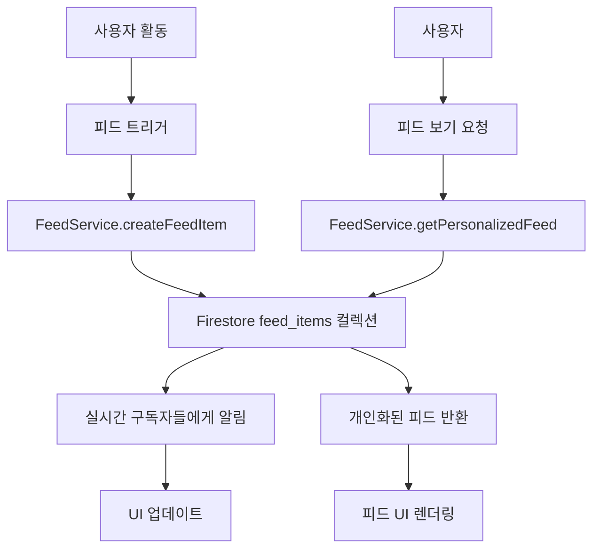

# 📰 Lightning Tennis 피드 시스템 설계

## 🎯 개요

Lightning Tennis의 **피드(Feed) 시스템**은 사용자들의 테니스 활동을 중심으로 한 소셜 네트워크 기능입니다. 사용자가 경기를 완료하거나 새로운 친구를 추가할 때마다, 이러한 활동들이 자동으로 피드에 기록되어 커뮤니티 내에서 공유됩니다.

## 🏗️ 시스템 아키텍처

### 핵심 구성 요소

1. **`feed_items` Firestore 컬렉션** - 모든 피드 활동 데이터 저장
2. **FeedService** - 피드 CRUD 작업 관리
3. **TypeScript 타입 시스템** - 타입 안전성과 개발자 경험 향상
4. **실시간 구독 시스템** - 실시간 피드 업데이트
5. **참여(Engagement) 시스템** - 좋아요, 댓글, 공유 기능

### 데이터 플로우



## 📊 Firestore 데이터베이스 구조

### `feed_items` 컬렉션

```typescript
// Document ID: auto-generated
{
  userId: string,              // 활동을 수행한 사용자
  activityType: string,        // 활동 유형 (match_completed, friend_added, etc.)
  timestamp: Timestamp,        // 활동 발생 시간
  visibility: string,          // 'public' | 'friends' | 'private'

  data: {                      // 활동별 특화 데이터
    // MatchCompletedData | FriendAddedData | AchievementData 등
  },

  engagement: {                // 참여 메트릭
    likes: [userId1, userId2],  // 좋아요한 사용자들
    likeCount: number,          // 좋아요 수 (비정규화)
    commentCount: number,       // 댓글 수 (비정규화)
    comments: []                // 댓글 데이터
  },

  metadata: {                  // 메타데이터
    location: string,           // 활동 위치
    relatedUsers: [userId],     // 관련된 다른 사용자들
    tags: [tag1, tag2],        // 태그/카테고리
    priority: string,           // 'high' | 'medium' | 'low'
    media: []                   // 첨부 미디어
  },

  createdAt: Timestamp,
  updatedAt: Timestamp,
  isDeleted: boolean
}
```

### `feed_items/{feedItemId}/comments` 하위 컬렉션

```typescript
{
  userId: string,
  userNickname: string,
  userProfileImage: string,
  content: string,
  timestamp: Timestamp,
  isDeleted: boolean,
  parentCommentId?: string     // 답글용 (미래 기능)
}
```

## 🎨 피드 활동 유형 (Activity Types)

### 1. 경기 관련 활동

- **`match_completed`** - 경기 완료 (승/패 무관)
- **`match_victory`** - 경기 승리 (특별 강조)
- **`streak_milestone`** - 연승 기록 달성
- **`elo_milestone`** - ELO 랭킹 마일스톤

### 2. 소셜 관련 활동

- **`friend_added`** - 새로운 친구 추가
- **`club_joined`** - 클럽 가입
- **`event_created`** - 이벤트 생성
- **`event_joined`** - 이벤트 참여

### 3. 성취 관련 활동

- **`achievement_unlocked`** - 업적 달성
- **`skill_improved`** - 실력 향상
- **`tournament_participation`** - 토너먼트 참가

### 4. 기타 활동

- **`profile_updated`** - 프로필 업데이트
- **`photo_shared`** - 사진 공유

## 🔧 주요 서비스 메서드

### FeedService 클래스 메서드

#### 피드 아이템 관리

```typescript
// 피드 아이템 생성
createFeedItem(request: CreateFeedItemRequest): Promise<string>

// 개인화된 피드 조회
getPersonalizedFeed(currentUserId: string, query?: FeedQuery): Promise<FeedItem[]>

// 특정 사용자 피드 조회
getUserFeed(userId: string, limit?: number): Promise<FeedItem[]>

// 피드 아이템 업데이트
updateFeedItem(feedItemId: string, updates: Partial<FeedItem>): Promise<void>

// 피드 아이템 삭제 (소프트 삭제)
deleteFeedItem(feedItemId: string, userId: string): Promise<void>
```

#### 참여 기능

```typescript
// 좋아요/좋아요 취소
toggleLike(feedItemId: string, userId: string, isLiking: boolean): Promise<void>

// 댓글 추가
addComment(feedItemId: string, userId: string, nickname: string, content: string): Promise<string>

// 댓글 조회
getComments(feedItemId: string, limit?: number): Promise<FeedComment[]>

// 댓글 삭제
deleteComment(feedItemId: string, commentId: string, userId: string): Promise<void>
```

#### 실시간 기능

```typescript
// 실시간 피드 구독
subscribeToFeed(currentUserId: string, query: FeedQuery, callback: Function): Unsubscribe
```

#### 편의 메서드

```typescript
// 경기 완료 피드 생성
createMatchCompletedFeed(userId: string, matchData: any): Promise<string>

// 친구 추가 피드 생성
createFriendAddedFeed(userId: string, friendData: any): Promise<string>

// 업적 달성 피드 생성
createAchievementFeed(userId: string, achievementData: any): Promise<string>
```

## 🎯 피드 개인화 알고리즘

### 피드 우선순위 계산

```typescript
// 기본 우선순위 (활동 유형별)
const FEED_PRIORITIES = {
  match_victory: 'high', // 경기 승리 - 높음
  achievement_unlocked: 'high', // 업적 달성 - 높음
  streak_milestone: 'high', // 연승 기록 - 높음
  match_completed: 'medium', // 경기 완료 - 중간
  friend_added: 'medium', // 친구 추가 - 중간
  profile_updated: 'low', // 프로필 업데이트 - 낮음
};

// 표시 우선순위 점수 계산
function calculateDisplayPriority(feedItem: FeedItem): number {
  let score = 0;

  // 활동 유형별 기본 점수
  score += priorityScores[feedItem.metadata.priority];

  // 참여도 보너스
  score += feedItem.engagement.likeCount * 2;
  score += feedItem.engagement.commentCount * 5;

  // 최신성 보너스
  const hoursOld = getHoursOld(feedItem.timestamp);
  if (hoursOld < 1) score += 50;
  else if (hoursOld < 6) score += 25;

  return score;
}
```

### 필터링 및 개인화

- **친구 네트워크 기반**: 친구들의 활동 우선 표시
- **활동 유형 필터링**: 사용자가 관심 있는 활동만 표시
- **위치 기반 필터링**: 같은 지역 활동 우선 표시
- **실력 레벨 고려**: 비슷한 실력의 사용자 활동 강조

## 📱 UI 컴포넌트 구조 계획

### 피드 화면 컴포넌트

```
📁 src/components/feed/
├── 📄 FeedScreen.tsx              # 메인 피드 화면
├── 📄 FeedItem.tsx                # 개별 피드 아이템
├── 📄 FeedItemHeader.tsx          # 피드 아이템 헤더 (사용자 정보)
├── 📄 FeedItemContent.tsx         # 피드 아이템 콘텐츠 (활동별 내용)
├── 📄 FeedItemActions.tsx         # 피드 아이템 액션 (좋아요, 댓글, 공유)
├── 📄 FeedComments.tsx            # 댓글 목록
├── 📄 CommentInput.tsx            # 댓글 입력
├── 📄 FeedFilters.tsx             # 피드 필터
├── 📄 ActivityTypeBadge.tsx       # 활동 유형 배지
└── 📁 activities/                 # 활동 유형별 전용 컴포넌트
    ├── 📄 MatchCompletedActivity.tsx
    ├── 📄 FriendAddedActivity.tsx
    ├── 📄 AchievementActivity.tsx
    └── 📄 ClubJoinedActivity.tsx
```

### 피드 아이템 렌더링 예시

```typescript
// FeedItem.tsx 구조 예시
interface FeedItemProps {
  feedItem: FeedItemDisplayData;
  currentUserId: string;
  onLike: (feedItemId: string, isLiking: boolean) => void;
  onComment: (feedItemId: string, content: string) => void;
  onShare?: (feedItemId: string) => void;
}

const FeedItem: React.FC<FeedItemProps> = ({ feedItem, currentUserId, onLike, onComment }) => {
  return (
    <View style={styles.feedItem}>
      <FeedItemHeader user={feedItem.user} timestamp={feedItem.timestamp} />
      <FeedItemContent activityType={feedItem.activityType} data={feedItem.data} />
      <FeedItemActions
        engagement={feedItem.engagement}
        isLiked={feedItem.isLiked}
        canLike={feedItem.canLike}
        canComment={feedItem.canComment}
        onLike={(isLiking) => onLike(feedItem.id, isLiking)}
        onComment={(content) => onComment(feedItem.id, content)}
      />
    </View>
  );
};
```

## 🔄 피드 생성 자동화

### 트리거 이벤트

피드 아이템은 다음 이벤트가 발생할 때 자동으로 생성됩니다:

```typescript
// 이벤트 핸들러 예시
class ActivityTracker {
  // 경기 완료 시
  async onMatchComplete(matchData: MatchData) {
    await feedService.createMatchCompletedFeed(matchData.userId, matchData);

    // 승리한 경우 추가 피드 생성
    if (matchData.result === 'win') {
      await feedService.createFeedItem({
        userId: matchData.userId,
        activityType: 'match_victory',
        data: { ...matchData, victoryType: 'regular' },
      });
    }
  }

  // 친구 추가 시
  async onFriendAdded(friendshipData: FriendshipData) {
    // 양방향 피드 생성
    await feedService.createFriendAddedFeed(friendshipData.userId, friendshipData);
    await feedService.createFriendAddedFeed(friendshipData.friendId, {
      ...friendshipData,
      userId: friendshipData.friendId,
      friendId: friendshipData.userId,
    });
  }

  // 업적 달성 시
  async onAchievementUnlocked(achievementData: AchievementData) {
    await feedService.createAchievementFeed(achievementData.userId, achievementData);
  }
}
```

## 🔐 프라이버시 및 보안

### 가시성 제어

- **`public`**: 모든 사용자가 볼 수 있음
- **`friends`**: 친구만 볼 수 있음 (기본값)
- **`private`**: 본인만 볼 수 있음

### 데이터 보안

- 사용자는 자신의 피드 아이템만 삭제 가능
- 댓글은 작성자와 피드 아이템 소유자만 삭제 가능
- 소프트 삭제를 사용하여 데이터 무결성 보장

### 스팸 방지

- 짧은 시간 내 동일한 활동 유형의 중복 피드 생성 방지
- 댓글 내용 검증 및 길이 제한
- 사용자별 일일 피드 생성 수 제한

## 📈 성능 최적화

### 데이터 비정규화

- `likeCount`, `commentCount` 필드로 빠른 조회
- 자주 사용되는 사용자 정보 피드에 직접 저장

### 캐싱 전략

- 최근 피드 데이터 로컬 캐싱
- 이미지 및 미디어 캐싱
- 사용자별 피드 설정 캐싱

### 페이지네이션

- 타임스탬프 기반 페이지네이션
- 무한 스크롤 지원
- 적응형 배치 크기

## 🌐 다국어 지원

### 활동 텍스트 현지화

```typescript
const FEED_ACTIVITY_LABELS = {
  ko: {
    match_completed: '경기를 완료했습니다',
    friend_added: '새로운 친구를 추가했습니다',
    achievement_unlocked: '새로운 업적을 달성했습니다',
  },
  en: {
    match_completed: 'completed a match',
    friend_added: 'added a new friend',
    achievement_unlocked: 'unlocked an achievement',
  },
};
```

### 시간 표시 현지화

- 한국어: "5분 전", "2시간 전", "어제"
- 영어: "5m ago", "2h ago", "yesterday"

## 🚀 향후 확장 계획

### Phase 1 - 기본 피드 (현재)

- [x] 피드 데이터 구조 설계
- [x] 피드 서비스 구현
- [x] 기본 CRUD 작업
- [ ] UI 컴포넌트 구현

### Phase 2 - 고급 기능

- [ ] 실시간 알림 시스템
- [ ] 피드 검색 기능
- [ ] 해시태그 시스템
- [ ] 피드 북마크 기능

### Phase 3 - AI 기능

- [ ] 개인화 추천 알고리즘
- [ ] 콘텐츠 기반 필터링
- [ ] 자동 태그 생성
- [ ] 스마트 알림

### Phase 4 - 고급 소셜 기능

- [ ] 피드 스토리 기능
- [ ] 라이브 업데이트
- [ ] 그룹 피드
- [ ] 커뮤니티 피드

## 📋 구현 체크리스트

### 백엔드 (Firestore & Services)

- [x] `feed_items` 컬렉션 구조 설계
- [x] TypeScript 타입 정의
- [x] FeedService 클래스 구현
- [x] CRUD 메서드 구현
- [x] 실시간 구독 메서드
- [ ] 보안 규칙 설정
- [ ] 인덱스 최적화

### 프론트엔드 (React Native)

- [ ] 피드 화면 기본 구조
- [ ] 개별 피드 아이템 컴포넌트
- [ ] 활동 유형별 전용 컴포넌트
- [ ] 좋아요/댓글 기능
- [ ] 실시간 업데이트 연동
- [ ] 무한 스크롤 구현
- [ ] 다국어 지원

### 통합 및 테스트

- [ ] 기존 기능과의 연동 (매치, 친구 시스템)
- [ ] 자동 피드 생성 트리거 구현
- [ ] 성능 테스트
- [ ] 사용자 테스트

---

이 설계를 바탕으로 Lightning Tennis의 피드 시스템은 사용자들의 테니스 활동을 중심으로 한 활발한 소셜 커뮤니티를 구축할 수 있습니다. 각 사용자의 성취와 활동이 자연스럽게 공유되어, 동기부여와 커뮤니티 참여를 높이는 효과를 기대할 수 있습니다.
